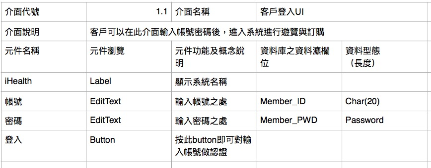
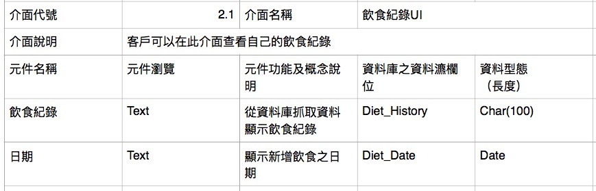

# iHealth愛健康管理APP 

---

## 組員：

劉偉承 0324094 資管3B （組長）

陳彥嘉 0324062 資管3B

郭哲宇 0324074 資管3B

## 工作分配:
組長 - 0324094 劉偉承：統籌、工作分配、上傳GitHub
0324062 陳彥嘉：參與討論、圖片繪製
0324074 郭哲宇：參與討論、使用者介面設計、繪製草圖

---
##一、文字敘述：

近年來，國人健康意識逐漸抬頭，開始注意日常生活中的飲食習慣。可是往往我不知道吃下的東西究竟是不是我們能提供我們足夠的營養。因此，為了解決以上問題，我們將開發一款「個人健康管理app」。透過這個app，使用者可以透過掃描食品、飲品上的條碼，詳細紀錄自己的日常飲食。透過分析結果獲知使用者缺乏哪些營養。

##二、Use case條件描述：

####1.使用者個案名稱：會員註冊

行為者：使用者

目標：讓使用者新增帳號密碼及身體狀況紀錄表 

前提：資料輸入要完整 

結束狀態：取得資料，回到主畫面 

正常程序：
A.系統接收到使用者資料 B.使用者註冊成功 （例外狀況：輸入格式錯誤或有空白尚未輸入）

####2.使用者個案名稱：會員登入

行為者：使用者 

目標：使用者可以使用APP功能 

前提：使用者需先註冊為會員 

結束狀態：取得資料，回到主畫面

正常程序：1.使用者透過帳號密碼登入系統 2.使用者登入成功 例外狀況：帳號密碼錯誤，登入失敗

####3.使用者個案名稱：新增資料

行為者：使用者 

目標：讓使用者可以新增飲食資訊 

結束狀態：取得資料，存入資料庫，回到主畫面 

正常程序：1.使用者進入新增畫面 2.利用掃條碼或手動輸入的功能新增資料
（例外狀況：條碼食品或飲料不存在資料庫）

####4.使用者個案名稱：修改資料

行為者：使用者 

目標：讓使用者可以修改飲食資訊 

結束狀態：修改資料，存入資料庫，回到主畫面 

正常程序：1.使用者點選欲修改的項目 2.修改資料並儲存

####5.使用者個案名稱：刪除資料

行為者：使用者 

目標：讓使用者可以刪除飲食資訊 

結束狀態：刪除資料，存入資料庫，回到主畫面 

正常程序：1.使用者點選欲刪除的項目 2.從資料刪除資料並儲存

####6.使用者個案名稱：分析飲食資料

行為者：開發者 

目標：開發者將使用者的飲食進行分析並回傳結果 

結束狀態：取得資料，顯示結果

正常程序：1.使用者透過分析結果UI查看 

## 三、APP功能與介面：

- 紀錄個人健康資訊
- 紀錄飲食攝取資訊（透過掃條碼或手動輸入）
- 分析個人飲食攝取的資訊
- 健康提醒與警告
-根據個人身體健康評估客製化飲食計劃 如瘦身計劃等

### 系統介面圖-1：

### 系統介面圖-2：

### 系統介面圖-3：

---

## 四、使用個案圖：

---     
## 五、活動圖：

---
## 六、循序圖：

---
## 七、物件之初始規格
### 「客戶登入」強韌圖物件之初始規格

### 「新增」強韌圖物件之初始規格

### 「修改」強韌圖物件之初始規格

### 「刪除」強韌圖物件之初始規格

---

## 八、強韌圖：

### 登入強韌圖

### 新增分析強韌圖：

### 刪除強韌圖：

### 修改強韌圖：

---
## 系統介面架構圖

##客戶登入之介面詞彙

##飲食紀錄之介面詞彙

##新增之介面詞彙

